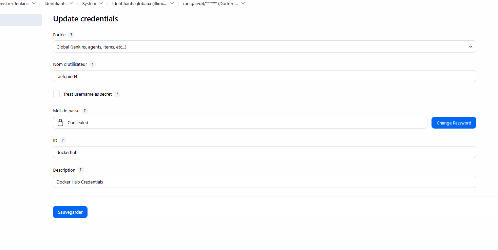
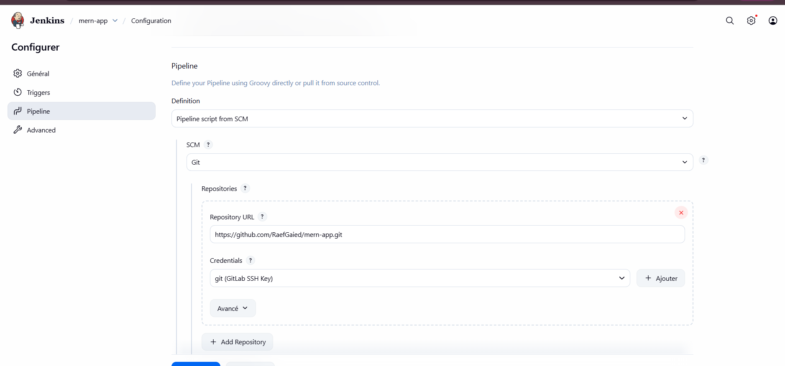
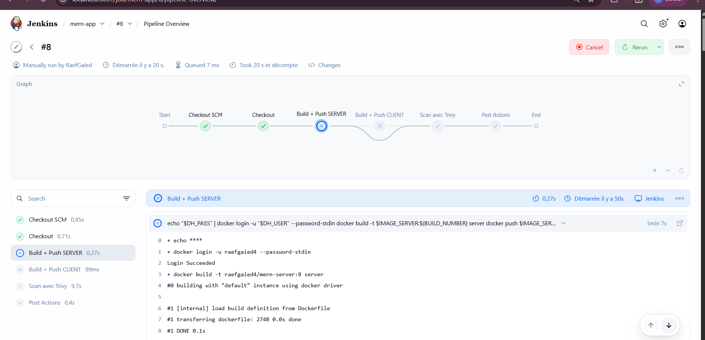
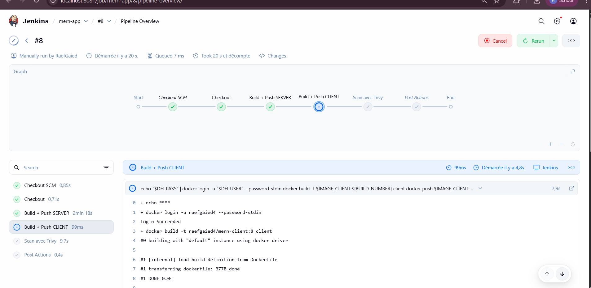

# 🚀 CI/CD avec Jenkins – MERN App (Server & Client)

Pipeline d'intégration et de déploiement continu pour une application MERN (MongoDB, Express, React, Node.js) utilisant Jenkins, Docker et Trivy.

---

## 📋 Table des matières

- [Objectif](#-objectif)
- [Architecture](#-architecture)
- [Étapes réalisées](#-étapes-réalisées)
- [Configuration Jenkins](#-configuration-jenkins)
- [Pipeline CI/CD](#-pipeline-cicd)
- [Résultats](#-résultats)
- [Outils utilisés](#-outils-utilisés)
- [Fichiers livrables](#-fichiers-livrables)

---

## 🎯 Objectif

Mettre en place un **pipeline d'intégration continue (CI/CD)** automatisé avec Jenkins pour :
- ✅ Builder et publier automatiquement les images Docker (Server & Client)
- ✅ Scanner les images pour les vulnérabilités avec **Trivy**
- ✅ Nettoyer automatiquement les artefacts Docker
- ✅ Déclencher le pipeline à chaque changement (Poll SCM)

---

## 🏗️ Architecture

```
GitHub (MERN App)
    ↓ (Webhook / Poll SCM)
Jenkins Server
    ├─→ Stage 1: Build & Push SERVER
    ├─→ Stage 2: Build & Push CLIENT
    ├─→ Stage 3: Scan Trivy SERVER
    ├─→ Stage 4: Scan Trivy CLIENT
    └─→ Cleanup & Reports
    ↓
DockerHub (raefgaied4/mern-server, raefgaied4/mern-client)
```

---

## 🔧 Étapes réalisées

### 1️⃣ Configuration de Jenkins

#### Prérequis
- Jenkins installé et exécuté en tant que conteneur
- Docker-in-Docker (dind) activé pour permettre à Jenkins de builder des images Docker
- Plugin Docker installé

#### Configuration des Credentials

**DockerHub Credentials :**
- Type: `Username with password`
- ID: `dockerhub`
- Username: `raefgaied4`
- Password/Token: Token DockerHub personnel



**GitLab SSH Credentials :**
- Type: `SSH Username with private key`
- ID: `gitlab_ssh`
- Username: `git`
- Private Key: Clé SSH privée


---

### 2️⃣ Création du Jenkinsfile

Le `Jenkinsfile` définit un **pipeline déclaratif** avec les étapes suivantes :

#### Structure générale
```groovy
pipeline {
    agent any
    triggers { pollSCM('H/5 * * * *') }  // Vérifier chaque 5 minutes
    environment {
        IMAGE_SERVER = 'raefgaied4/mern-server'
        IMAGE_CLIENT = 'raefgaied4/mern-client'
    }
    stages {
        // Voir le Jenkinsfile complet ci-dessous
    }
}
```

#### Étapes principales

| Étape | Description |
|-------|-------------|
| **Checkout** | Clone le repo GitHub avec les credentials SSH |
| **Build + Push SERVER** | Build et push l'image Docker du serveur (déclenché si `server/**` change) |
| **Build + Push CLIENT** | Build et push l'image Docker du client (déclenché si `client/**` change) |
| **Scan Trivy SERVER** | Analyse les vulnérabilités de l'image serveur |
| **Scan Trivy CLIENT** | Analyse les vulnérabilités de l'image client |
| **Cleanup** | Nettoie le cache Docker et affiche les rapports |

---

## 🔐 Pipeline CI/CD

### Démarrage du conteneur Jenkins


### Création du Pipeline



### Full Pipeline


### Stage: Scan Trivy


### Stage: Build & Push Server



### Stage: Build & Push Client



---

## 📊 Résultats

### Rapports Trivy

Après chaque exécution du pipeline, les rapports de sécurité sont générés :

- **trivy_server_report.txt** : Détection des vulnérabilités dans `mern-server`
- **trivy_client_report.txt** : Détection des vulnérabilités dans `mern-client`

### Images publiées

Les images Docker sont disponibles sur **DockerHub** :
- `raefgaied4/mern-server:${BUILD_NUMBER}`
- `raefgaied4/mern-client:${BUILD_NUMBER}`

---

## 🛠️ Outils utilisés

| Outil | Version | Rôle |
|-------|---------|------|
| **Jenkins** | Latest | Orchestration du pipeline CI/CD |
| **Docker** | Latest | Containerisation des applications |
| **Trivy** | Latest | Scan de vulnérabilités des images |
| **DockerHub** | - | Registry pour les images Docker |
| **GitHub** | - | Repository Git avec Jenkinsfile |

---

## 📁 Fichiers livrables

```
.
├── README.md                    # Documentation complète (ce fichier)
├── Jenkinsfile                  # Pipeline déclaratif Jenkins
├── screenshots/
│   ├── dockerhub_credential.png
│   ├── gitlab_ssh_credential.png
│   ├── demmarage_du_conteneurs.png
│   ├── creation_de_pipeline.png
│   ├── full_pipeline.png
│   ├── pipeline_stage_scan_trivy.png
│   ├── pipeline_stage_build_push_server.png
│   └── pipeline_stage_build_push_client.png
└── server/                      # Code source serveur (dans GitHub)
    └── Dockerfile
└── client/                      # Code source client (dans GitHub)
    └── Dockerfile
```

---

## 🚀 Comment utiliser

### 1. **Prérequis**
```bash
# Avoir Jenkins, Docker et Docker-in-Docker configurés
# Avoir accès à DockerHub
# Avoir une clé SSH pour GitHub/GitLab
```

### 2. **Configuration initiale**
- Ajouter les credentials DockerHub et GitLab SSH dans Jenkins
- Créer un nouveau pipeline job pointant vers ce repository
- Configurer le Jenkinsfile comme script pipeline

### 3. **Déclencher le pipeline**
Le pipeline s'exécute automatiquement :
- ✅ À chaque commit sur `main`
- ✅ Toutes les 5 minutes (pollSCM)
- ✅ Seulement les changements affectant `server/` ou `client/`

### 4. **Consulter les rapports**
```bash
# Accéder aux logs Jenkins
# Consulter les rapports Trivy dans la console
# Vérifier les images publiées sur DockerHub
```

---

## 📈 Métriques et Monitoring

- **Build Success Rate** : Suivi depuis le dashboard Jenkins
- **Scan Trivy Reports** : Analyses de vulnérabilités sauvegardées
- **DockerHub Insights** : Statistiques des téléchargements et pulls

---

## ✅ Améliorations futures

- [ ] Intégration de SonarQube pour l'analyse de code
- [ ] Tests automatisés dans le pipeline
- [ ] Déploiement en cluster Kubernetes
- [ ] Notifications Slack pour les builds
- [ ] Cache des layers Docker pour accélérer les builds

---

## 📞 Support

Pour toute question ou problème :
1. Vérifier les logs Jenkins
2. Consulter les rapports Trivy
3. Vérifier les credentials DockerHub et GitLab
4. Valider la configuration Docker-in-Docker

---

**Créé avec ❤️ pour l'automatisation CI/CD** | Dernière mise à jour: 2025
